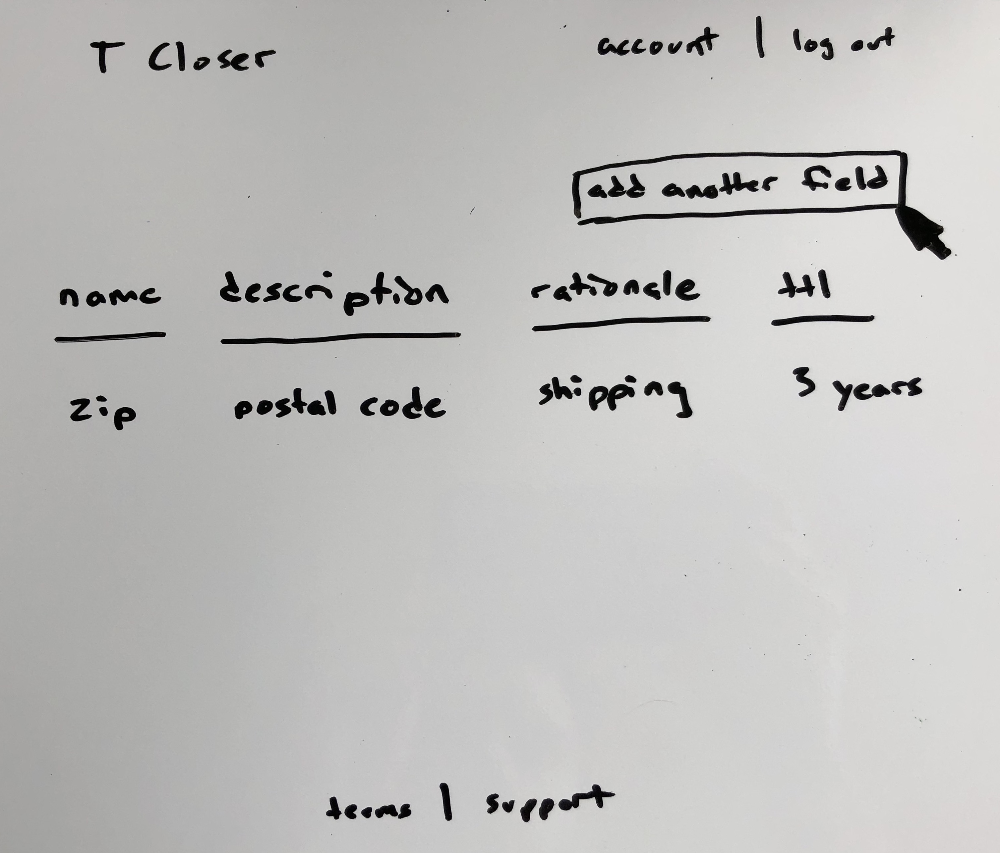
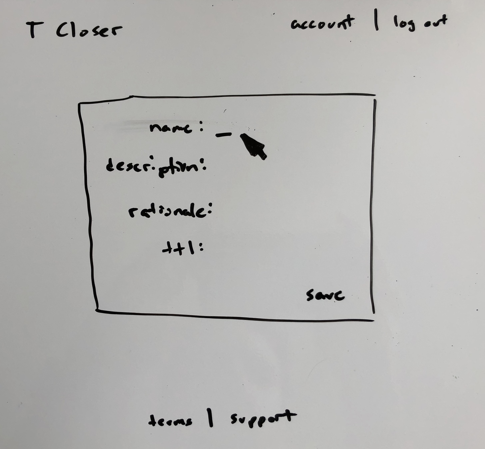
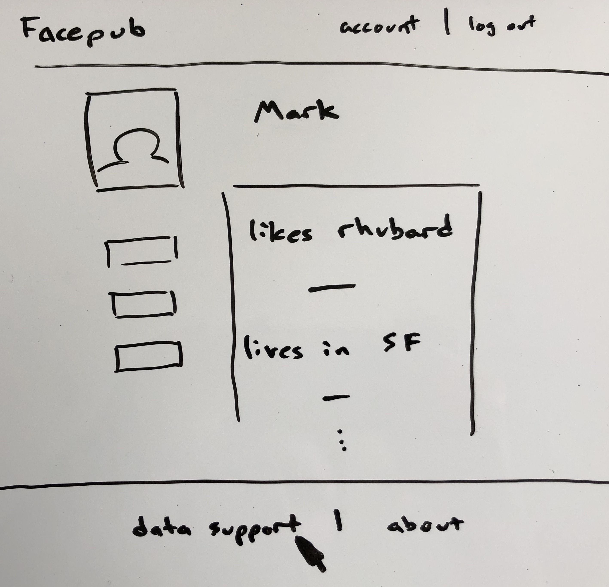
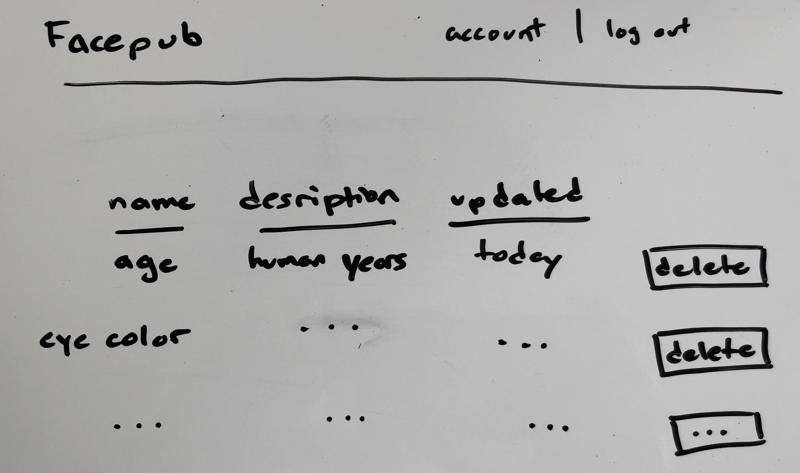

# T Closer

Reducing private data risk.

<!-- To re-generate this run `doctype README.md` -->
<!-- START doctoc generated TOC please keep comment here to allow auto update -->
<!-- DON'T EDIT THIS SECTION, INSTEAD RE-RUN doctoc TO UPDATE -->


- [Overview](#overview)
  - [For Companies](#for-companies)
    - [T Closer Project Administration](#t-closer-project-administration)
  - [For Their Customers](#for-their-customers)
    - [Data Support](#data-support)
- [Integration](#integration)
  - [Adding Compliant Data Support to Your Website](#adding-compliant-data-support-to-your-website)
    - [Create a Project](#create-a-project)
    - [Add Data Support to Your Website](#add-data-support-to-your-website)
    - [Programmatically Set and Get User Data](#programmatically-set-and-get-user-data)

<!-- END doctoc generated TOC please keep comment here to allow auto update -->

## Overview

T Closer is a privacy-first user data service. Beyond that, we ensure compliance with the latest regulations like GDPR.

Included features:
* A managed list of all types of personal data, who you share it with, what you do with it, and how long you keep it.
* A public privacy policy.
* A portal for users easy access to their data and the ability to update or delete.
* A list of any data sub-processors you may use.
* Automatic reports any data breaches to local authorities and affected users.
* A Data Protection Officer in the EU.
* Encrypted data at rest.

### For Companies

Specify what data fields you need, and we will make sure you capture and use the data in a compliant way.

#### T Closer Project Administration

In the T Closer project page, add each user data field you want to use.



Make sure to include the required fields.



### For Their Customers

On your website users have easy access to view what data you have stored about them. They can also see how you use that data and have the option to delete it.

#### Data Support

Using our SDKs makes it easy to include a data support page.





## Integration

### Adding Compliant Data Support to Your Website

#### Create a Project

1. Create a project in the T Closer console<link here>.
2. In the project overview page, click **New Data Field** and for each field supply the necessary information: [See Project Administration Overview](#t-closer-project-administration)
  1. Name
  2. Description
  3. Use for provided service
  4. Lifetime

#### Add Data Support to Your Website

Our SDK will build the table and handle all user interactions for you.

```javascript
<table>
  <script
    src="https://static.tcloser.com/userdatatable/0.0.1/userdatatable.js"
    data-key="<API_KEY>"
    data-project="<PROJECT_ID>"
    data-user="<USER_ID>"
  </script>
</table>
```

#### Programmatically Set and Get User Data

Add the code to you project in the head tag, before other scripts:

```Javascript
<script src="https://static.tcloser.com/tcloserjs/0.0.1/tcloser.js"></script>
<script>
  // Initialize T Closer
  // TODO: Replace with your project's API key and ID
  var config = {
    apiKey: "<API_KEY>",
    projectId: "<PROJECT_ID>",
  };
  tcloser.initializeApp(config);
</script>
```

Use the client as you would any user data store.

```Javascript
// Set user data
// `userID` is frequently an authentication token provided by another 3rd party
tcloser.user(userID).set({
  name: name,
  email: email,
  gender: male,
  address: address,
  city: city,
  state: state,
  zip: zip
});

// Get user Data
tcloser.user(userID).get(
  function(data) {
    updateAddress(userID, data);
  };
);
```
